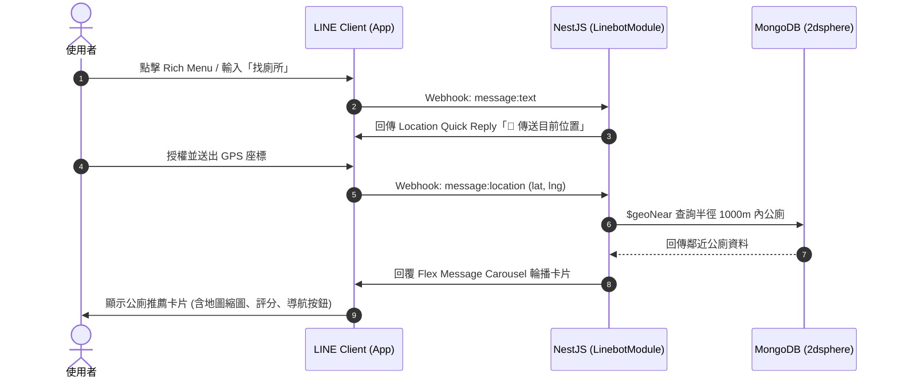

# Bathroom Genius 廁所達人 - Backend Server

> 智慧公廁搜尋、推薦、評分與即時互助評價後端服務系統。

[](LICENSE)
[](https://nestjs.com/)
[](https://nodejs.org/)
[](https://pnpm.io/)
[-47A248?logo=mongodb)](https://www.mongodb.com/)
[](https://developers.line.biz/)

---

## 📖 專案簡介 (Intro)

**Bathroom Genius 廁所達人** 是一個專為「即時解急」需求打造的智慧公廁導航與社群評價平台系統。

本專案基於 **NestJS (TypeScript)**，透過 **MongoDB GeoJSON 2dsphere 空間索引** 提供鄰近公廁地理位置搜尋，並透過 **LINE Messaging API (LINE Bot)**，讓使用者出門在外時，只需在 LINE 通訊軟體內提供座標，即可獲得鄰近公廁清單、動態地圖縮圖、設施狀態、乾淨度評價以及 Google Maps 步行導航。

### ✨ 核心特色
- 📍 **地理空間智慧搜尋**：使用 MongoDB `$geoNear` 進行半徑公廁搜尋與步行直線距離計算。
- 🤖 **LINE Bot 無縫互動**：
  - Rich Menu 圖文選單一鍵觸發。
  - Quick Reply 原生地圖定位選取。
  - LINE Flex Message Carousel 輪播推薦卡片。
  - Google Maps Static API 動態鄰近地圖縮圖。
  - 一鍵喚起 Google Maps 步行導航。
  - Postback Action 即時查看最新評價。
- ⭐ **互助社群與評分機制**：支援匿名/具名提交公廁評價、乾淨度與便利度星級、衛生紙現場狀態回報。
- 🛡️ **安全與嚴格校驗**：
  - 全域 ValidationPipe 驗證與 DTO 欄位過濾。
  - LINE Webhook HMAC-SHA256 簽章守衛 (`LineSignatureGuard`) 與 Raw Body 驗證。
- 📚 **完整 API 文件**：整合 Swagger OpenAPI 互動式文件介面 (`/docs`)。

---

## 🛠️ Self-Hosting Guide (自託管與本地建置指南)

### 1. 環境需求 (Prerequisites)
- **Node.js**: `v20.0.0` 或以上版本
- **pnpm**: 專案唯一指定套件管理器（請勿使用 npm / yarn）
- **MongoDB**: `v6.0` 或以上版本（本地實例或 MongoDB Atlas）
- **LINE Developer 帳號**: 需建立 Messaging API Channel 取得 Access Token 與 Channel Secret
- **Google Maps API Key** *(選填)*: 用於生成地圖靜態縮圖（Google Maps Static API）
- **ngrok / 穿透工具** *(本地開發 Webhook 測試時需使用)*

---

### 2. 安裝與設定 (Installation & Setup)

#### 步驟 1：Clone 專案並安裝依賴
```bash
git clone https://github.com/Sianglife/bathroom-genius-server.git
cd bathroom-genius-server

# 安裝依賴 (唯一指定 pnpm)
pnpm install
```

#### 步驟 2：設定環境變數
複製 `.env.sample` 為 `.env`，並填入對應的設定值：

```bash
cp .env.sample .env
```

`.env` 參數說明清單：

| 變數名稱 | 必填 | 說明 | 範例 / 預設值 |
| :--- | :---: | :--- | :--- |
| `PORT` | 否 | 應用程式運行 Port | `3000` |
| `NODE_ENV` | 否 | 運行環境 (`development` / `production`) | `development` |
| `MONGODB_URI` | **是** | MongoDB 連線字串 | `mongodb://localhost:27017` |
| `MONGODB_DB_NAME` | **是** | 資料庫名稱 | `bathroom` |
| `LINE_CHANNEL_ACCESS_TOKEN` | **是** | LINE Messaging API Channel Access Token | `your_channel_access_token` |
| `LINE_CHANNEL_SECRET` | **是** | LINE Channel Secret (用於 Webhook 驗簽) | `your_channel_secret` |
| `GOOGLE_MAPS_STATIC_API_KEY`| 否 | Google Maps Static API 金鑰 (用於地圖縮圖) | `AIzaSy...` |
| `DNS_SERVERS` | 否 | 自訂 DNS 伺服器 (多組以逗號分隔) | `1.1.1.1,8.8.8.8` |
| `JWT_SECRET` | 否 | 預留 JWT Token 認證金鑰 | `optional_secret_for_future` |

---

### 3. 啟動服務 (Running the Server)

```bash
# 開發模式 (熱重載)
pnpm run start:dev

# 編譯 TypeScript
pnpm run build

# 生產模式啟動
pnpm run start:prod

# 除錯模式
pnpm run start:debug
```

啟動完成後：
- **RESTful API 基礎路徑**: `http://localhost:3000/api`
- **Swagger API 文件**: `http://localhost:3000/docs`
- **健康檢查端點**: `http://localhost:3000/api/health`

---

### 4. LINE Bot Webhook 與圖文選單配置

#### 4.1 建立本地外部通道 (ngrok)
本地端測試 LINE Webhook 需要公開的 HTTPS 網址：

```bash
ngrok http 3000
```
取得對外網址後（例如 `https://xxxx.ngrok-free.app`），前往 [LINE Developers Console](https://developers.line.biz/)：
1. 進入 Messaging API 設定頁籤。
2. 設定 **Webhook URL** 為：`https://xxxx.ngrok-free.app/api/linebot/webhook`。
3. 開啟 **Use webhook** 開關，並點擊 **Verify** 進行驗證。

#### 4.2 Rich Menu 圖文選單自動化管理工具
本專案內建 Rich Menu 自動產生與發布腳本：

```bash
# 一鍵自動生成圖檔、建立 Rich Menu 並設定為全體用戶預設選單
pnpm run linebot:richmenu

# 查詢目前頻道所有 Rich Menu 清單
pnpm run linebot:richmenu list

# 將特定 Rich Menu 設為預設
pnpm run linebot:richmenu set-default <richMenuId>

# 刪除指定 Rich Menu
pnpm run linebot:richmenu delete <richMenuId>

# 清空頻道所有 Rich Menu
pnpm run linebot:richmenu clear
```

---

## 🤝 Contribution Guide (貢獻指南與架構說明)

歡迎任何形式的貢獻（Pull Requests / Issues）！請遵循以下規範與專案結構。

### 專案目錄結構 (Project Structure)

```text
bathroom-genius-server/
├── assets/                  # 靜態資源 (Rich Menu 預設圖檔等)
├── scripts/                 # 維護與自動化腳本
│   ├── generate-richmenu-image.ts # Rich Menu 圖片產生工具
│   └── setup-richmenu.ts    # Rich Menu 一鍵註冊與管理 CLI
├── src/
│   ├── app.controller.ts    # 根控制器
│   ├── app.module.ts        # 應用程式主模組 (Mongoose / Config / 模組裝載)
│   ├── app.service.ts       # 根服務
│   ├── main.ts              # 伺服器進入點 (ValidationPipe / Swagger / CORS)
│   ├── common/              # 全域通用元件
│   │   ├── filters/         # HttpException 全域過濾器
│   │   └── pipes/           # ParseObjectIdPipe 等自訂轉換管道
│   └── modules/             # 系統功能子模組
│       ├── auth/            # 認證守衛 (OptionalJwtAuthGuard, CurrentUser)
│       ├── health/          # 健康檢查模組 (GET /api/health)
│       ├── linebot/         # LINE Bot 模組
│       │   ├── constants/   # Rich Menu 規範常數與樣板設定
│       │   ├── dto/         # Webhook 請求資料結構 (LineWebhookDto)
│       │   ├── guards/      # HMAC-SHA256 簽章守衛 (LineSignatureGuard)
│       │   ├── services/    # 事件分發器與 Flex Message 模板產生器
│       │   ├── linebot.controller.ts # Webhook 接收端點
│       │   └── linebot.module.ts
│       ├── reviews/         # 公廁評價與評分模組
│       │   ├── dto/         # 評論請求 DTO
│       │   ├── schemas/     # Review Mongoose Schema
│       │   ├── reviews.controller.ts
│       │   ├── reviews.service.ts
│       │   └── reviews.module.ts
│       └── toilets/         # 公廁資料管理與空間搜尋模組
│           ├── dto/         # 廁所 CRUD & 空間附近查詢 DTO
│           ├── schemas/     # Toilet Mongoose Schema (2dsphere 索引)
│           ├── toilets.controller.ts
│           ├── toilets.service.ts
│           └── toilets.module.ts
├── test/                    # 端到端 (E2E) 測試套件
│   ├── app.e2e-spec.ts
│   └── linebot.e2e-spec.ts  # LINE Webhook E2E 簽章與全流程測試
├── .env.sample              # 環境變數範本
├── nest-cli.json            # NestJS CLI 設定檔
├── package.json             # 專案依賴與腳本定義
├── tsconfig.json            # TypeScript 編譯設定
└── README.md                # 專案說明文件
```

---

### 模組說明 (Module Part)

#### 1. 🤖 LINEBOT (`src/modules/linebot/`)
- **Webhook 端點**：`POST /api/linebot/webhook`
- **安全防護**：`LineSignatureGuard` 解析 Header `x-line-signature` 與 `req.rawBody`，透過 `@line/bot-sdk` 的 `validateSignature` 進行 HMAC-SHA256 嚴格防偽檢驗。
- **事件處理器 (`LinebotService`)**：
  - **文字訊息 (`message:text`)**：偵測「找廁所」或點選 Rich Menu 時，回覆附帶 `location` action 的 Quick Reply 按鈕。
  - **位置訊息 (`message:location`)**：接收經緯度座標，調用 `ToiletsService.findNearby()` 查詢 1000m 範圍內廁所，組裝 Flex Message Carousel 卡片回傳。
  - **Postback 動作 (`postback`)**：解析 `action=view_reviews&toiletId=...`，即時調用 `ReviewsService.findByToiletId()` 回傳最新評價卡片。
- **模板產生器 (`LinebotTemplateService`)**：
  - 產生地圖縮圖 URL（支援 Google Maps Static API）。
  - 組裝多卡輪播 Carousel、星級圖示、衛生紙與無障礙設備標籤、Google Maps 步行導航 URI Action 與評價 Postback Action。



---

#### 2. 🌐 Standard API (標準 RESTful API)

全域路徑前綴：`/api`

##### 🚻 Toilets 模組 (`/api/toilets`)
- `POST /api/toilets`：新增公廁資訊（支援匿名或帶 Token）。
- `GET /api/toilets`：條件篩選、關鍵字查詢與分頁列表。
- `GET /api/toilets/nearby`：依據 `latitude`、`longitude` 與 `radius`（公尺）進行地理空間鄰近推薦。
- `GET /api/toilets/:id`：取得單一公廁詳細資料與評分統計。
- `PATCH /api/toilets/:id`：更新公廁資訊。
- `DELETE /api/toilets/:id`：刪除公廁及其關聯評論。

##### 💬 Reviews 模組 (`/api/reviews` & `/api/toilets/:id/reviews`)
- `POST /api/toilets/:id/reviews`：為特定公廁新增評分與評論，系統將**自動連動重算**該公廁之平均乾淨度、便利度與評論總數。
- `GET /api/toilets/:id/reviews`：查詢特定公廁之評論列表（支援分頁與時間降冪排序）。
- `PATCH /api/reviews/:id`：修改特定評論內容或評分並連動重算。
- `DELETE /api/reviews/:id`：刪除特定評論並連動重算。

##### 💓 Health 模組 (`/api/health`)
- `GET /api/health`：回傳伺服器狀態與 UTC 時間戳記。

---

#### 3. 📄 Docs (Swagger 互動文件)
- **路徑**：`http://localhost:3000/docs`
- 具備完整 DTO Schema 模型定義、欄位驗證說明、範例 Payload 與 Bearer JWT Token 測試支援。

---

### 測試與程式碼風格 (Testing & Code Quality)

在提交 PR 之前，請確保程式碼風格符合規範且所有測試通過：

```bash
# 格式化程式碼 (Prettier)
pnpm run format

# ESLint 檢查與自動修復
pnpm run lint

# 執行單元測試
pnpm run test

# 執行測試覆蓋率報告
pnpm run test:cov

# 執行端到端 (E2E) 測試
pnpm run test:e2e
```

---

## 📜 授權協議 (License)

本專案採用 [MIT License](LICENSE) 授權釋出。