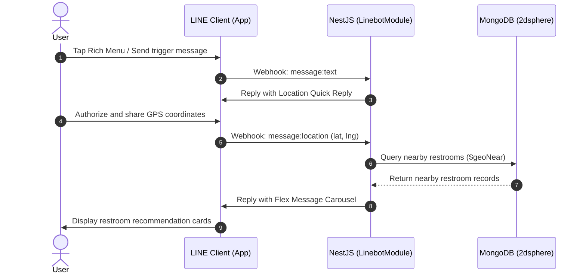

# Bathroom Genius - Backend Server

> Intelligent public restroom discovery, recommendation, rating, and community review backend service.

[](LICENSE)
[](https://nestjs.com/)
[](https://nodejs.org/)
[](https://pnpm.io/)
[-47A248?logo=mongodb)](https://www.mongodb.com/)
[](https://developers.line.biz/)

---

## Introduction

**Bathroom Genius** is a backend system designed for immediate, on-demand public restroom discovery, navigation, and community review sharing.

Built with **NestJS (TypeScript)**, the system leverages **MongoDB GeoJSON 2dsphere spatial indexing** to provide high-precision nearby restroom queries. It deeply integrates with the **LINE Messaging API (LINE Bot)**, allowing users on the go to share their current location within the LINE messaging app without installing additional native applications. Users receive real-time recommendations featuring dynamic static map thumbnails, facility attributes, cleanliness ratings, and one-tap Google Maps walking navigation.

### Key Features
- **Geospatial Smart Search**: Utilizes MongoDB `$geoNear` aggregation with 2dsphere indexing for radius-based search and accurate walking distance calculations.
- **Seamless LINE Bot Integration**:
  - Rich Menu one-click trigger.
  - Native location picker via Quick Reply.
  - Interactive LINE Flex Message Carousel recommendation cards.
  - Dynamic static map thumbnail generation via Google Maps Static API.
  - One-tap Google Maps walking navigation.
  - Postback actions for instant review inspection.
- **Community Reviews & Ratings**: Supports anonymous and authenticated review submissions, cleanliness and convenience star ratings, real-time toilet paper availability reporting, and automated average score recalculation.
- **Security & Validation**:
  - Global ValidationPipe for payload sanitation and DTO whitelisting.
  - LINE Webhook HMAC-SHA256 signature verification (`LineSignatureGuard`) with raw body validation.
- **Interactive Documentation**: Built-in Swagger OpenAPI specification and interactive testing UI (`/docs`).

---

## Self-Hosting Guide

### 1. Prerequisites
- **Node.js**: `v20.0.0` or later
- **pnpm**: Sole designated package manager for this project (do not use npm or yarn)
- **MongoDB**: `v6.0` or later (Local instance or MongoDB Atlas)
- **LINE Developers Account**: A Messaging API Channel with Channel Access Token and Channel Secret
- **Google Maps API Key** *(Optional)*: Required for generating static map thumbnails (Google Maps Static API)
- **ngrok / Tunneling Utility** *(Required for local Webhook testing)*

---

### 2. Installation & Setup

#### Step 1: Clone the Repository and Install Dependencies
```bash
git clone https://github.com/Sianglife/bathroom-genius-server.git
cd bathroom-genius-server

# Install dependencies using pnpm
pnpm install
```

#### Step 2: Configure Environment Variables
Copy `.env.sample` to `.env` and fill in the required values:

```bash
cp .env.sample .env
```

Environment variable reference:

| Variable | Required | Description | Default / Example |
| :--- | :---: | :--- | :--- |
| `PORT` | No | Application port | `3000` |
| `NODE_ENV` | No | Runtime environment (`development` / `production`) | `development` |
| `MONGODB_URI` | **Yes** | MongoDB connection URI | `mongodb://localhost:27017` |
| `MONGODB_DB_NAME` | **Yes** | MongoDB database name | `bathroom` |
| `LINE_CHANNEL_ACCESS_TOKEN` | **Yes** | LINE Messaging API Channel Access Token | `your_channel_access_token` |
| `LINE_CHANNEL_SECRET` | **Yes** | LINE Channel Secret (used for Webhook signature verification) | `your_channel_secret` |
| `GOOGLE_MAPS_STATIC_API_KEY`| No | Google Maps Static API Key (for map thumbnails) | `AIzaSy...` |
| `DNS_SERVERS` | No | Custom DNS servers (comma-separated) | `1.1.1.1,8.8.8.8` |
| `JWT_SECRET` | No | Reserved JWT secret for future authentication extension | `optional_secret_for_future` |

---

### 3. Running the Server

```bash
# Development mode with hot-reload
pnpm run start:dev

# Build TypeScript to production bundle
pnpm run build

# Start production server
pnpm run start:prod

# Debug mode
pnpm run start:debug
```

Once running:
- **RESTful API Base URL**: `http://localhost:3000/api`
- **Swagger Documentation**: `http://localhost:3000/docs`
- **Health Check Endpoint**: `http://localhost:3000/api/health`

---

### 4. LINE Bot Webhook & Rich Menu Setup

#### 4.1 Setup Public Webhook Tunnel (ngrok)
To test LINE Webhook locally, expose port 3000 via a public HTTPS URL:

```bash
ngrok http 3000
```
Copy the forwarding HTTPS URL (e.g. `https://xxxx.ngrok-free.app`) and configure it in the [LINE Developers Console](https://developers.line.biz/):
1. Navigate to your Messaging API Channel settings.
2. Set **Webhook URL** to: `https://xxxx.ngrok-free.app/api/linebot/webhook`.
3. Enable the **Use webhook** toggle.
4. Click **Verify** to test connectivity.

#### 4.2 Automated Rich Menu Management CLI
The repository includes automated scripts to generate, register, and manage Rich Menus:

```bash
# Generate image, register Rich Menu, and set as default for all users
pnpm run linebot:richmenu

# List all existing Rich Menus in the Channel
pnpm run linebot:richmenu list

# Set a specific Rich Menu as default
pnpm run linebot:richmenu set-default <richMenuId>

# Delete a specific Rich Menu
pnpm run linebot:richmenu delete <richMenuId>

# Clear all Rich Menus in the Channel
pnpm run linebot:richmenu clear
```

---

## Contribution Guide

Contributions, issues, and feature requests are welcome. Please adhere to the project structure and guidelines below.

### Project Structure

```text
bathroom-genius-server/
├── assets/                  # Static assets (Rich menu image templates, etc.)
├── scripts/                 # Utility and automation CLI scripts
│   ├── generate-richmenu-image.ts # Rich menu image generator
│   └── setup-richmenu.ts    # Rich menu management script
├── src/
│   ├── app.controller.ts    # Root controller
│   ├── app.module.ts        # Root module (Mongoose / Config / Module aggregation)
│   ├── app.service.ts       # Root service
│   ├── main.ts              # Application bootstrap (ValidationPipe / Swagger / CORS)
│   ├── common/              # Shared components
│   │   ├── filters/         # Global HttpException filter
│   │   └── pipes/           # ParseObjectIdPipe and custom validation pipes
│   └── modules/             # Application sub-modules
│       ├── auth/            # Authentication guards (OptionalJwtAuthGuard, CurrentUser)
│       ├── health/          # Health check module (GET /api/health)
│       ├── linebot/         # LINE Bot module
│       │   ├── constants/   # Rich menu definitions and template constants
│       │   ├── dto/         # Webhook payload DTOs (LineWebhookDto)
│       │   ├── guards/      # HMAC-SHA256 signature guard (LineSignatureGuard)
│       │   ├── services/    # Event dispatcher and Flex message template builder
│       │   ├── linebot.controller.ts # Webhook entry point
│       │   └── linebot.module.ts
│       ├── reviews/         # Reviews and ratings module
│       │   ├── dto/         # Review request DTOs
│       │   ├── schemas/     # Review Mongoose Schema
│       │   ├── reviews.controller.ts
│       │   ├── reviews.service.ts
│       │   └── reviews.module.ts
│       └── toilets/         # Restroom management and geospatial search module
│           ├── dto/         # Restroom CRUD and nearby search DTOs
│           ├── schemas/     # Toilet Mongoose Schema (2dsphere index)
│           ├── toilets.controller.ts
│           ├── toilets.service.ts
│           └── toilets.module.ts
├── test/                    # End-to-end (E2E) test suite
│   ├── app.e2e-spec.ts
│   └── linebot.e2e-spec.ts  # LINE Webhook E2E tests
├── .env.sample              # Environment variable template
├── nest-cli.json            # NestJS CLI configuration
├── package.json             # Project dependencies and npm scripts
├── tsconfig.json            # TypeScript compiler configuration
└── README.md                # Project documentation
```

---

### Module Overview

#### 1. LINEBOT (`src/modules/linebot/`)
- **Webhook Endpoint**: `POST /api/linebot/webhook`
- **Security**: `LineSignatureGuard` extracts the `x-line-signature` header and `req.rawBody`, executing HMAC-SHA256 signature verification via `@line/bot-sdk`.
- **Event Dispatcher (`LinebotService`)**:
  - **Text Message (`message:text`)**: Detects trigger keywords or Rich Menu clicks and returns a Quick Reply button for location sharing.
  - **Location Message (`message:location`)**: Receives latitude and longitude, invokes `ToiletsService.findNearby()` to find restrooms within 1000m, and replies with a Flex Message Carousel.
  - **Postback Action (`postback`)**: Parses `action=view_reviews&toiletId=...` and queries `ReviewsService.findByToiletId()` to return recent reviews.
- **Template Generator (`LinebotTemplateService`)**:
  - Computes Google Maps Static API thumbnail URLs.
  - Constructs multi-card Carousels with star ratings, facility badges (toilet paper, accessibility, 24H status), Google Maps walking navigation URI actions, and review Postback actions.



---

#### 2. Standard RESTful API

Global prefix: `/api`

##### Toilets Module (`/api/toilets`)
- `POST /api/toilets`: Create a new restroom record (supports anonymous or authenticated submissions).
- `GET /api/toilets`: Retrieve a paginated list of restrooms with keyword and attribute filtering.
- `GET /api/toilets/nearby`: Geospatial discovery based on `latitude`, `longitude`, and `radius` (meters).
- `GET /api/toilets/:id`: Retrieve restroom details along with rating statistics.
- `PATCH /api/toilets/:id`: Update restroom information.
- `DELETE /api/toilets/:id`: Delete a restroom and its associated reviews.

##### Reviews Module (`/api/reviews` & `/api/toilets/:id/reviews`)
- `POST /api/toilets/:id/reviews`: Add a review and rating for a restroom; automatically recalculates the target restroom's average cleanliness, convenience, and total review count.
- `GET /api/toilets/:id/reviews`: Retrieve paginated reviews for a specific restroom, sorted by creation date descending.
- `PATCH /api/reviews/:id`: Update an existing review and trigger score recalculation.
- `DELETE /api/reviews/:id`: Delete a review and trigger score recalculation.

##### Health Module (`/api/health`)
- `GET /api/health`: Returns server status and UTC timestamp.

---

#### 3. API Documentation (Swagger OpenAPI)
- **Path**: `http://localhost:3000/docs`
- Contains complete DTO schema definitions, validation rules, request/response examples, and Bearer JWT authentication testing support.

---

### Testing & Code Quality

Before opening a pull request, ensure all code style checks and test suites pass:

```bash
# Format code with Prettier
pnpm run format

# Lint code and fix issues with ESLint
pnpm run lint

# Run unit tests
pnpm run test

# Run test coverage report
pnpm run test:cov

# Run End-to-End (E2E) tests
pnpm run test:e2e
```

---

## License

This project is licensed under the [MIT License](LICENSE).